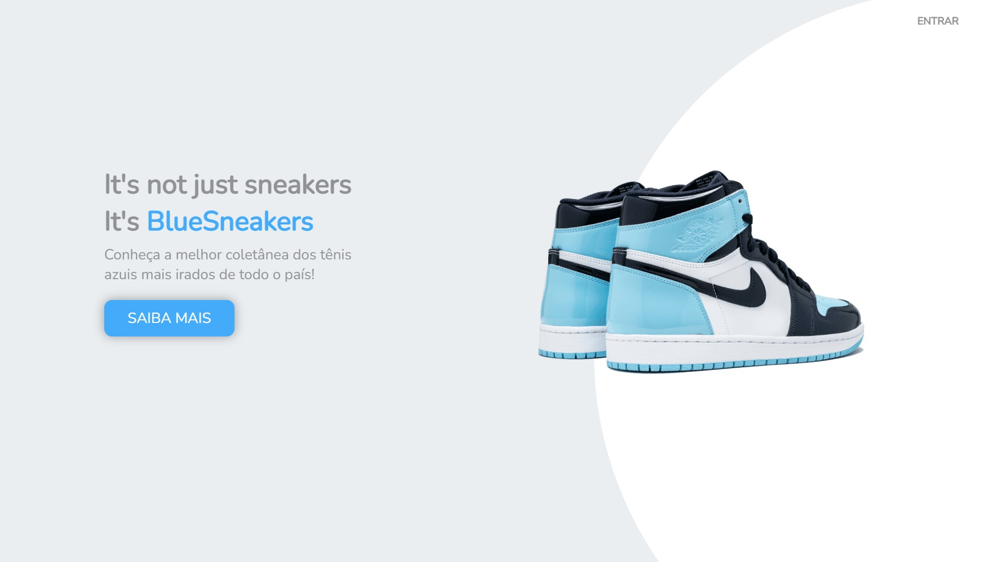

# BlueSneakers

## Sobre

 Website produzido em função do desejo de estudar e utilizar LocalStorage para a construção de telas de registro e de login que funcionem.
Ademais, a oportunidade foi aproveitada para o desenvolver de algumas páginas com recursos estilísticos que não usufruíra até então.

 

Atualmente em processo de desenvolvimento.

Já apresenta responsividade nas telas de home, registro e login.

 

Agradecimentos ao <a href="https://github.com/iuricode">Iuri Silva</a>, pois o design da tela de home foi embasado em um de seus desafios.

## Tecnologias
- HTML5;
- CSS3;
- JavaScript.

## Links
- <a href="https://www.figma.com/file/UXf9Ol62iXb08xLofhKQYi/BlueSneakers---LocalStorage-Trainning?node-id=0%3A1">Projeto no Figma</a>;
- Site.
